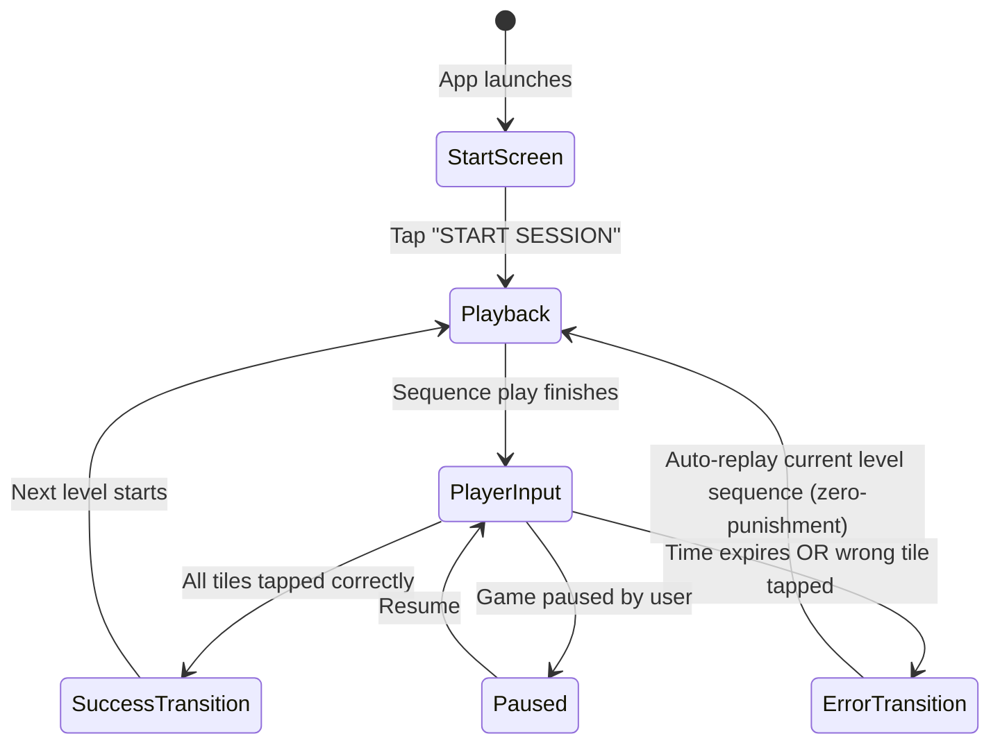

# Focus Spark — Project Summary

**Focus Spark** is an immersive, gamified mindfulness memory app built with Flutter. It challenges users' focus and memory capacity by presenting pentatonic tone and visual tile sequences on a 3x3 interactive matrix. 

---

## 🚀 Key Features

*   **Mindful Simon-Says Gameplay:** Players watch a sequence of flashing tiles, listen to their corresponding pentatonic chime tones, and then reproduce the pattern within a dynamic countdown time limit.
*   **Zen Mode:** A specialized feature that hides HUD telemetry (current Level, Streak, Best Score) to reduce performance pressure and cognitive load, leaving only the therapeutic audio-visual interface.
*   **Custom Audio Synthesizers:** Instead of playing static MP3/WAV files, the application synthesizes clean sine/triangle chime tones in real-time. It uses conditional compilation to run natively on Android (via Kotlin's `AudioTrack`) and on the Web (via JS Web Audio API).
*   **Dynamic Particle Engine:** Spawns physics-based spark particles (`SparkParticle`) using a custom Flutter canvas painter when tiles are activated or when a level is successfully completed.
*   **Theming Options:** Three beautiful dark-mode theme presets (Cosmic Indigo, Sage Calm, and Midnight Cyber) accessible via theme selection icons situated in the top header bar next to the sound toggle.
*   **Cyberpunk Glowing Neon Energy Timer Bar:** Built a 10px rounded capsule track (`_buildInputTimerBar()`) with live digital seconds readout (`05.4s`), dynamic 3-stage urgency color shifting (`TIME REMAINING` Theme Accent ➔ `HURRY UP!` Golden Amber ➔ `CRITICAL TIME!` Neon Red), and a sliding leading-edge energy spark orb that glides across the track as time counts down.
*   **Candy Crush-Style Arcade Victory Celebration Engine:** Upgraded level completion into a high-energy celebration featuring:
    *   *Physics-Based Multi-Color Confetti Rain*: 45 rotating rectangular confetti ribbons in 7 neon colors with gravity and tilt rotation.
    *   *Matrix Grid Ripple Wave Sweep*: Staggered 9-tile glowing wave highlight across the board with ascending 9-note audio chime arpeggios (`_triggerGridRippleWave()`).
    *   *3-Star Performance Rating System (⭐⭐⭐)*: Evaluates timer bar percentage upon completion to award 3 Stars ⭐⭐⭐ (`PERFECT SPARK! ⚡` >65% time), 2 Stars ⭐⭐ (`GREAT FOCUS! 🎯` 30%–65% time), or 1 Star ⭐ (`LEVEL CLEARED! 🏁` <30% time) on the Level Complete Modal.
*   **Single Peak Entry Leaderboard System & Editable Gamer Tag (✏️):** Refactored `_recordLeaderboardScore()` and `_loadSettings()` [`lib/main.dart`](file:///d:/focus_spark_git/focus_spark/lib/main.dart#L438) to maintain a single top entry per player (`_deduplicateLeaderboardEntries()`). Added a glassmorphic **`[ ✏️ Gamer Tag ]`** edit button to the Leaderboard modal header (`_showEditPlayerNameModal()`) allowing players to customize their gamer tag (up to 14 characters) with full `SharedPreferences` persistence (`focus_spark_player_name`). All local leaderboard entries dynamically update to reflect the player's active custom gamer tag. The active player's row is highlighted in the Leaderboard with a **2.0px Cyberpunk Neon Border**, outer glowing shadow aura, accent text color, and a golden/black **`YOU`** badge tag. Added automated backward-compatible deduplication on startup to sanitize existing local storage entries.
*   **Dynamic Continue / New Session Action:** The home screen action button dynamically detects saved progress. If an active session exists, it displays a primary **`CONTINUE (LVL X)`** button alongside a **`NEW SESSION`** button; otherwise, it displays **`NEW SESSION`**, now positioned lower (`56.0dp` top margin) for comfortable, thumb-friendly access.
*   **Full-Width Edge-to-Edge Layout Architecture:** The top header control bar (`[ 🏆 Leaderboard ]` → `[ 🏠 Home ]` → `[ 🎵 Music ]` → `[ 🔊 SFX ]` → `[ ❓ How to Play ]` → `[ 🧘 Zen ]` → `[ 🎨 Theme Dots ]`) and bottom banner ad space are unconstrained from central width caps, featuring generous top padding (`28.0dp`) for a comfortable, well-proportioned display layout.
*   **Clean Modular Architecture & Single Responsibility Principle:** Refactored the monolithic codebase into clean, decoupled single-responsibility modules under `lib/`:
    *   `lib/game/game_state_enums.dart`: `GameState` and `HapticType` enums.
    *   `lib/models/`: `game_theme.dart`, `particle.dart`, `leaderboard_entry.dart`.
    *   `lib/utils/`: `particle_manager.dart` (ParticleManager & ParticlePainter).
    *   `lib/ui/components/`: `animated_gradient_bg.dart`, `shake_widget.dart`, `hint_tile_pulse.dart`.
    *   `lib/ui/screens/`: `company_splash_screen.dart`, `fullscreen_splash_screen.dart`.
    *   *Zero Regression*: Preserved 100% of game mechanics, visual aesthetics, particle physics, 👆 Spotlight Focus Dimming tutorial, audio synthesis, and ad integrations. Verified with 100% clean test execution (`flutter test`).
*   **Full-Screen Ad Lifecycle Pause & Resume Engine:** Integrated `onAdOpened` and `onAdClosed` lifecycle listeners in `AdService` and `_FocusSparkScreenState`. When a Rewarded or Interstitial ad displays, ambient background music automatically pauses (`AudioService.instance.stopAmbientMusic()`), input timers stop (`_cancelInputTimer()`), and game state freezes (`_gameState = GameState.paused`). Updated `_startSession()` to launch Level 1 immediately (`launchGame()`) without triggering Interstitial ads on fresh installs, cleared app data, or new game starts. Interstitial ads strictly display on level completion milestones (Levels 6, 8, 10, 12, 14, 16+) as configured in `AdService.shouldShowInterstitialOnLevelComplete()`.
*   **Interactive Animated Visual Guided Tutorial System (👆):** Implemented a guided tutorial overlay (`_buildInteractiveTutorialOverlay()`) featuring an animated floating hand pointer icon 👆 (`_tutorialHandController`), target pulsing halo rings over matrix tiles, and step-by-step floating Orbitron 3D neon text typography:
    *   *Generous Step Pauses & Unhurried Reading*: Added a **2.4-second pre-playback pause** before Step 1 sequence flashes start so players can comfortably read *"Get ready to observe the sequence..."*, slowed tile flashes to **1000ms (1 full second)** with **600ms gap**, and added a **2.2-second transition pause** before Step 2 player input begins so players can comfortably read *"Now tap the exact same tile!"*.
    *   *Spotlight Focus Dimming Effect*: During Level 1 & Level 2 tutorial moves, all non-target surrounding tiles automatically dim down to **28% opacity**, while the active target tile shines at **100% full vibrant neon illumination**. This draws 100% of first-time players' focus directly onto the move!
    *   *Boxless Floating 3D Typography*: Removed the dark dialogue box container, borders, and rounded card shape. The step instructions float as pure 3D neon text with multi-layer glowing drop shadows for a completely clean, borderless presentation.
    *   *Strict Level 1 & Level 2 Active Window*: The guided visual tutorial, hidden timer bar, and relaxed playback speed strictly apply to **Level 1** and **Level 2** (`_level <= 2`). Upon completing Level 2 (advancing to Level 3), the tutorial automatically completes (`_isVisualTutorialActive = false`), preference is saved (`focus_spark_has_seen_tutorial = true`), and full-speed gameplay with timer bar resumes!
    *   *Dynamic Smart Avoidance Banner Positioning*: The step instruction banner automatically shifts to `bottom: 8` when top-row tiles (tiles 0, 1, 2) are targetted, and stays at `top: 8` for middle/bottom row tiles, ensuring zero overlap and 100% tile visibility for all moves.
    *   *Stress-Free Unlimited Time & Relaxed Pace*: The input timer bar is completely hidden (`_buildInputTimerBar()`) and the input timeout is disabled during Level 1 & 2 tutorial mode (`_isVisualTutorialActive && _level <= 2`), providing first-time players with unlimited time to read instructions and tap at their own pace.
    *   *First-Time Auto-Trigger & Replay*: Automatically triggers on Level 1 for new players and can be replayed anytime via **`START VISUAL DEMO 👆`** inside the **`[ ❓ How to Play ]`** modal.
*   **Harmonic C-Major Pentatonic Synth & Error Tune Audio Engine:** Retuned matrix grid tile frequencies (`_frequencies`) [`lib/main.dart`](file:///d:/focus_spark_git/focus_spark/lib/main.dart#L140) to a pure, 2-octave consonant **C-Major Pentatonic Scale** (`C4 261.63Hz`, `D4 293.66Hz`, `E4 329.63Hz`, `G4 392.00Hz`, `A4 440.00Hz`, `C5 523.25Hz`, `D5 587.33Hz`, `E5 659.25Hz`, `G5 783.99Hz`), removing dissonant semitones (`F4` & `B4`). Added a signature **2-Note Descending Arcade Wrong Move Tune** (`_playWrongMoveTune()`: `Eb3 155.56Hz` ➔ `C3 130.81Hz` error slide) triggering on wrong tile taps and input timer timeouts. Upgraded Native Android (`MainActivity.kt`) and Web Audio API (`web/index.html`) sound synthesis with a **Dual-Harmonic Crystal Synth Engine** combining warm fundamental oscillators with 2nd-harmonic overtones (`4π f t`) and octave sparkles for rich, therapeutic electronic chimes on every tile tap.
*   **Focus-Themed Animated Praise & Failure Text Popups:** Implemented a Candy Crush-style praise & encouragement text overlay system (`_triggerPraiseText()`) featuring boxless Orbitron 3D-effect neon typography (`26px`), multi-layer glowing text shadows, elastic spring scale-up (`Curves.elasticOut`), and particle spark bursts.
    *   *Success Praises*: `NICE FOCUS! 🎯`, `SPARK! ⚡`, `SHARP! ⚔️`, `SYNAPSE SURGE! ⚡`, `SUPERCHARGED! 🔋`, `MASTERMIND! 👑`
    *   *Failure Text*: Strictly displays **`TRY AGAIN! 🔄`** in dynamic Crimson Red (`Color(0xFFEF4444)`).
*   **Tactile Haptic Feedback System & Dedicated Header Control (`📳`):** Implemented a multi-tier haptic engine (`_triggerHaptic()`) featuring mild, crisp vibrations on every matrix tile tap (`55ms`), dual victory haptic bursts on pattern completion (`120ms` + `60ms`), heavy error impacts (`160ms`), and rhythmic heartbeat haptics during **CRITICAL TIME (< 20% remaining)**. Added `<uses-permission android:name="android.permission.VIBRATE"/>` in `AndroidManifest.xml` and native Android Kotlin `Vibrator` / `VibrationEffect` MethodChannel in `MainActivity.kt` with explicit `AudioAttributes.USAGE_GAME` and `255` maximum amplitude, ensuring physical vibrations bypass Android OS system-level touch feedback sliders and trigger reliably across all Android devices (Samsung, Xiaomi/MIUI, OnePlus, Pixel). Added a dedicated **`[ 📳 Haptics ]`** toggle button in the top header bar with full `SharedPreferences` persistence.
*   **Separate Audio Header Controls (`🎵 Music` / `🔊 SFX` / `📳 Haptic`):** Dedicated header buttons for **Music (`🎵`)** (toggles ambient background pad `_isMusicMuted`), **SFX (`🔊`)** (toggles tile chimes & victory SFX `_isSfxMuted`), and **Haptics (`📳`)** (toggles tactile vibrations `_isHapticsMuted`), with full `SharedPreferences` persistence.
*   **On-Demand Header Tutorial Modal:** Accessible via a Help icon button (`Icons.help_outline_rounded`) in the top header control bar. Opens a sleek glassmorphic modal dialog with step-by-step game instructions and a "GOT IT!" dismissal button, keeping the Home Screen splash view ultra-clean and spacious.
*   **Interactive Candy Crush-Style Level Roadmap:** Tapping the Orbital Pulse Hero Logo on the Home Screen launches a glassmorphic level map with a winding S-curve path, node states (passed checkmarks `✔️`, active level flame `🔥`, personal best peak level smooth breathing scale `_PulsingBestPeakNode`, future level nodes), smart auto-scroll, and milestone rank banners at Levels 5, 10, 15, 20, 25, and 30.
*   **Google AdMob Test Ads Integration:** Integrated `google_mobile_ads: ^5.2.0` with singleton `AdService` using official Google Test Ad Unit IDs:
    *   **Async On-Demand Native Ad Loading (`showRewardedAdOrLoad` / `showInterstitialAdOrLoad`)**: On mobile devices, if an ad is not preloaded yet when requested, `AdService` fetches Google's live test ad over the network and presents Google's official native test ad view rather than falling back to simulated UI.
    *   **Live Native Banner Ad Widget Binding**: `_buildBannerAdSpace()` binds `AdWidget(ad: _bannerAd!)` directly inside a 320x50 container whenever `_isBannerAdLoaded` is true, displaying Google's official live test banner on mobile devices.
    *   **Bottom Banner Ad**: Displayed live in the 52dp bottom container space (`ca-app-pub-3940256099942544/6300978111`).
    *   **Rewarded Hint Ad**: Plays Google Test Rewarded Video Ad (`ca-app-pub-3940256099942544/5224354917`) on tapping `HINT (+AD)` and awards +1 free hint upon watching.
    *   **Custom Interstitial Ad Frequency**: Displays Interstitial Test Ads (`ca-app-pub-3940256099942544/1033173712`) on session resets, skips Levels 1–5, shows every 2 levels for Levels 6–15 (L6, L8, L10, L12, L14), and shows after completing every level for Levels 16+.
*   **Enhanced Minimal Home Page Hero:** Features a dynamic orbital pulsing hero logo (`_OrbitalHeroLogo`) with rotating orbit ring, ambient spark aura, clean header (game title text removed for ultra-minimalist focus), and a refined glassmorphic tutorial guide card while preserving the 3 color theme presets.
*   **Local Top 10 Hall of Fame Leaderboard:** Accessible exclusively via a glowing Trophy icon (`Icons.emoji_events_outlined`) in the top header bar on the **Home Screen** (hidden during gameplay to keep the game scene clean). Features a glassmorphic modal with Top 3 Podium highlights (🥇 Gold, 🥈 Silver, 🥉 Bronze), displaying Player Name, Level, Streak, and Date achieved, with full local `SharedPreferences` JSON persistence.
*   **Home Navigation Button:** Located in the top header control bar right next to the Sound toggle button (`Icons.home_outlined`). Tapping it during gameplay safely saves current game progress and returns the player to the home screen, enabling them to resume playing via `CONTINUE (LVL X)` at any time.
*   **Reserved Bottom Banner Ad Space:** Dedicated 52dp bottom bar (`_buildBannerAdSpace`) reserved below the main game scrollview, ensuring zero layout shifts or button overlaps when AdMob banner ads load in production.
*   **1-Free-Hint & Direct Rewarded Ad System:** Players get 1 free hint per level round (`💡 HINT (FREE)`), which triggers a dedicated **silent continuous pulse & blink animation** (`_HintTilePulse`) on the next correct tile without playing chime audio. The tile continuously blinks until the player taps it. If additional hints are needed in the same level, tapping `🎬 HINT (+AD)` directly launches a video ad experience without pop-up modals, automatically revealing the continuous pulse hint upon completion.
*   **Responsive Multi-Screen Layout:** The entire user interface adapts dynamically to all mobile screen sizes (small, medium, and wide). Bottom controls and action buttons use flexible `Wrap` layouts and adaptive padding to ensure zero RenderFlex overflow across all device dimensions.
*   **State Persistence:** High scores, active level & sequence, mute state, Zen mode preference, chosen theme, and tutorial-seen preferences are saved locally using the `shared_preferences` package.

---

## 📂 Architecture & File Directory

The project follows a standard Flutter structure, with custom integrations for web and native platform channels:

*   **Core UI & Game Logic:**
    *   [`lib/main.dart`](file:///d:/focus_spark_git/focus_spark/lib/main.dart): Houses the entire application interface, widget hierarchy, themes, custom animation classes, and particle engine.
*   **Cross-Platform Audio Service:**
    *   [`lib/services/audio_service.dart`](file:///d:/focus_spark_git/focus_spark/lib/services/audio_service.dart): The abstract interface that handles conditional imports between web and native implementations.
    *   [`lib/services/audio_service_native.dart`](file:///d:/focus_spark_git/focus_spark/lib/services/audio_service_native.dart): Invokes native synthesizers over Flutter's `MethodChannel`.
    *   [`lib/services/audio_service_web.dart`](file:///d:/focus_spark_git/focus_spark/lib/services/audio_service_web.dart): Interfaces with JavaScript using JS interop for web-based sound synthesis.
    *   [`lib/services/audio_service_stub.dart`](file:///d:/focus_spark_git/focus_spark/lib/services/audio_service_stub.dart): A fallback stub for unsupported platforms.
*   **Native & Web Synthesizer Backends:**
    *   [`android/app/src/main/kotlin/com/focusspark/focus_spark/MainActivity.kt`](file:///d:/focus_spark_git/focus_spark/android/app/src/main/kotlin/com/focusspark/focus_spark/MainActivity.kt): Implements a background-threaded sine wave PCM generator with a 5ms Hann window envelope to prevent audio popping.
    *   [`web/index.html`](file:///d:/focus_spark_git/focus_spark/web/index.html): Defines `window.playSparkTone` using the browser's Web Audio API with a warm triangle oscillator type and an Attack-Decay envelope.

---

## 🔄 Game Loop & State Machine

The game is governed by the [`GameState`](file:///d:/focus_spark_git/focus_spark/lib/main.dart#L45) enum, which transitions through the following phases:



1.  **`GameState.startScreen`**: The user is welcomed by a beautiful title, theme select, and session history summary.
2.  **`GameState.playback`**: The app plays the generated tile sequence step-by-step. Tiles light up and chime at their pentatonic frequency.
3.  **`GameState.playerInput`**: The player must replicate the sequence. A countdown timer runs concurrently, giving the player `6.0 + sequence.length * 1.2` seconds to respond.
4.  **`GameState.paused`**: Halts input and timer progression.
5.  **`GameState.successTransition`**: Triggers particle explosions, plays success tones, and advances the level.
6.  **`GameState.errorTransition`**: Triggers haptic vibration, shakes the target tile, plays a low error tone, resets the current streak, and transitions back to **`GameState.playback`** to replay the pattern.
7.  **Immediate Gameplay Restart**: At any point during active gameplay, users can tap the **`RESTART`** button to instantly wipe the current progress and begin a new session at Level 1, without returning to the home screen. This utilizes a `_playbackSessionId` generator to cancel any concurrent or lingering audio-visual loops from the previous session.

---

## 🛠️ Dev Ops & Commands

### Running Locally
To launch the application on a connected device/emulator/browser:
```powershell
flutter run
```

### Running Widget & Unit Tests
To execute automated tests (such as the smoke test in [`test/widget_test.dart`](file:///d:/focus_spark_git/focus_spark/test/widget_test.dart)):
```powershell
flutter test
```

### Building the Project
To generate release builds for mobile or web platforms:
```powershell
flutter build apk
flutter build web
```
