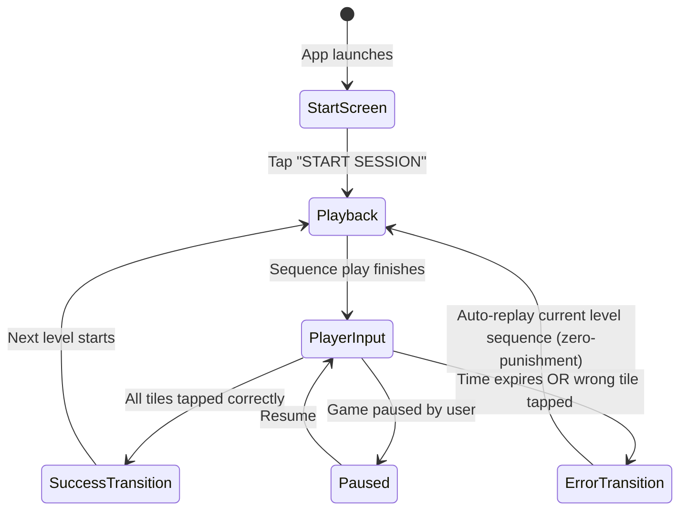

# Focus Spark — Project Summary

**Focus Spark** is an immersive, gamified mindfulness memory app built with Flutter. It challenges users' focus and memory capacity by presenting pentatonic tone and visual tile sequences on a 3x3 interactive matrix. 

---

## 🚀 Key Features

*   **Mindful Simon-Says Gameplay:** Players watch a sequence of flashing tiles, listen to their corresponding pentatonic chime tones, and then reproduce the pattern within a dynamic countdown time limit.
*   **Zen Mode:** A specialized feature that hides HUD telemetry (current Level, Streak, Best Score) to reduce performance pressure and cognitive load, leaving only the therapeutic audio-visual interface.
*   **Custom Audio Synthesizers:** Instead of playing static MP3/WAV files, the application synthesizes clean sine/triangle chime tones in real-time. It uses conditional compilation to run natively on Android (via Kotlin's `AudioTrack`) and on the Web (via JS Web Audio API).
*   **Dynamic Particle Engine:** Spawns physics-based spark particles (`SparkParticle`) using a custom Flutter canvas painter when tiles are activated or when a level is successfully completed.
*   **Theming Options:** Three beautiful dark-mode theme presets (Cosmic Indigo, Sage Calm, and Midnight Cyber) accessible via theme selection icons situated in the top header bar next to the sound toggle.
*   **Game Level & Session Persistence:** Automatically saves the player's active level, sequence pattern, and current streak to `SharedPreferences`. Closing and reopening the app preserves exact progress without resetting to level 1.
*   **Dynamic Continue / New Session Action:** The home screen action button dynamically detects saved progress. If an active session exists, it displays a primary **`CONTINUE (LVL X)`** button alongside a **`NEW SESSION`** button; otherwise, it displays **`NEW SESSION`**, now positioned lower (`36.0dp` top margin) for comfortable, thumb-friendly access.
*   **Full-Width Edge-to-Edge Layout Architecture:** The top header control bar (`[ 🏆 Leaderboard ]` → `[ 🔊 Sound ]` → `[ ❓ How to Play ]` → `[ 🧘 Zen ]` → `[ 🎨 Theme Dots ]`) and bottom banner ad space are unconstrained from central width caps, featuring generous top padding (`28.0dp`) for a comfortable, well-proportioned display layout.
*   **On-Demand Header Tutorial Modal:** Accessible via a Help icon button (`Icons.help_outline_rounded`) in the top header control bar. Opens a sleek glassmorphic modal dialog with step-by-step game instructions and a "GOT IT!" dismissal button, keeping the Home Screen splash view ultra-clean and spacious.
*   **Interactive Candy Crush-Style Level Roadmap:** Tapping the Orbital Pulse Hero Logo on the Home Screen launches a glassmorphic level map with a winding S-curve path, node states (passed checkmarks `✔️`, active level flame `🔥`, personal best peak level smooth breathing scale `_PulsingBestPeakNode`, future level nodes), smart auto-scroll, and milestone rank banners at Levels 5, 10, 15, 20, 25, and 30.
*   **Enhanced Minimal Home Page Hero:** Features a dynamic orbital pulsing hero logo (`_OrbitalHeroLogo`) with rotating orbit ring, ambient spark aura, clean header (game title text removed for ultra-minimalist focus), and a refined glassmorphic tutorial guide card while preserving the 3 color theme presets.
*   **Local Top 10 Hall of Fame Leaderboard:** Accessible exclusively via a glowing Trophy icon (`Icons.emoji_events_outlined`) in the top header bar on the **Home Screen** (hidden during gameplay to keep the game scene clean). Features a glassmorphic modal with Top 3 Podium highlights (🥇 Gold, 🥈 Silver, 🥉 Bronze), displaying Player Name, Level, Streak, and Date achieved, with full local `SharedPreferences` JSON persistence.
*   **Home Navigation Button:** Located in the top header control bar right next to the Sound toggle button (`Icons.home_outlined`). Tapping it during gameplay safely saves current game progress and returns the player to the home screen, enabling them to resume playing via `CONTINUE (LVL X)` at any time.
*   **Reserved Bottom Banner Ad Space:** Dedicated 52dp bottom bar (`_buildBannerAdSpace`) reserved below the main game scrollview, ensuring zero layout shifts or button overlaps when AdMob banner ads load in production.
*   **1-Free-Hint & Direct Rewarded Ad System:** Players get 1 free hint per level round (`💡 HINT (FREE)`), which triggers a dedicated **silent continuous pulse & blink animation** (`_HintTilePulse`) on the next correct tile without playing chime audio. The tile continuously blinks until the player taps it. If additional hints are needed in the same level, tapping `🎬 HINT (+AD)` directly launches a video ad experience without pop-up modals, automatically revealing the continuous pulse hint upon completion.
*   **Responsive Multi-Screen Layout:** The entire user interface adapts dynamically to all mobile screen sizes (small, medium, and wide). Bottom controls and action buttons use flexible `Wrap` layouts and adaptive padding to ensure zero RenderFlex overflow across all device dimensions.
*   **State Persistence:** High scores, active level & sequence, mute state, Zen mode preference, chosen theme, and tutorial-seen preferences are saved locally using the `shared_preferences` package.

---

## 📂 Architecture & File Directory

The project follows a standard Flutter structure, with custom integrations for web and native platform channels:

*   **Core UI & Game Logic:**
    *   [`lib/main.dart`](file:///d:/focus_spark_git/focus_spark/lib/main.dart): Houses the entire application interface, widget hierarchy, themes, custom animation classes, and particle engine.
*   **Cross-Platform Audio Service:**
    *   [`lib/services/audio_service.dart`](file:///d:/focus_spark_git/focus_spark/lib/services/audio_service.dart): The abstract interface that handles conditional imports between web and native implementations.
    *   [`lib/services/audio_service_native.dart`](file:///d:/focus_spark_git/focus_spark/lib/services/audio_service_native.dart): Invokes native synthesizers over Flutter's `MethodChannel`.
    *   [`lib/services/audio_service_web.dart`](file:///d:/focus_spark_git/focus_spark/lib/services/audio_service_web.dart): Interfaces with JavaScript using JS interop for web-based sound synthesis.
    *   [`lib/services/audio_service_stub.dart`](file:///d:/focus_spark_git/focus_spark/lib/services/audio_service_stub.dart): A fallback stub for unsupported platforms.
*   **Native & Web Synthesizer Backends:**
    *   [`android/app/src/main/kotlin/com/focusspark/focus_spark/MainActivity.kt`](file:///d:/focus_spark_git/focus_spark/android/app/src/main/kotlin/com/focusspark/focus_spark/MainActivity.kt): Implements a background-threaded sine wave PCM generator with a 5ms Hann window envelope to prevent audio popping.
    *   [`web/index.html`](file:///d:/focus_spark_git/focus_spark/web/index.html): Defines `window.playSparkTone` using the browser's Web Audio API with a warm triangle oscillator type and an Attack-Decay envelope.

---

## 🔄 Game Loop & State Machine

The game is governed by the [`GameState`](file:///d:/focus_spark_git/focus_spark/lib/main.dart#L45) enum, which transitions through the following phases:



1.  **`GameState.startScreen`**: The user is welcomed by a beautiful title, theme select, and session history summary.
2.  **`GameState.playback`**: The app plays the generated tile sequence step-by-step. Tiles light up and chime at their pentatonic frequency.
3.  **`GameState.playerInput`**: The player must replicate the sequence. A countdown timer runs concurrently, giving the player `6.0 + sequence.length * 1.2` seconds to respond.
4.  **`GameState.paused`**: Halts input and timer progression.
5.  **`GameState.successTransition`**: Triggers particle explosions, plays success tones, and advances the level.
6.  **`GameState.errorTransition`**: Triggers haptic vibration, shakes the target tile, plays a low error tone, resets the current streak, and transitions back to **`GameState.playback`** to replay the pattern.
7.  **Immediate Gameplay Restart**: At any point during active gameplay, users can tap the **`RESTART`** button to instantly wipe the current progress and begin a new session at Level 1, without returning to the home screen. This utilizes a `_playbackSessionId` generator to cancel any concurrent or lingering audio-visual loops from the previous session.

---

## 🛠️ Dev Ops & Commands

### Running Locally
To launch the application on a connected device/emulator/browser:
```powershell
flutter run
```

### Running Widget & Unit Tests
To execute automated tests (such as the smoke test in [`test/widget_test.dart`](file:///d:/focus_spark_git/focus_spark/test/widget_test.dart)):
```powershell
flutter test
```

### Building the Project
To generate release builds for mobile or web platforms:
```powershell
flutter build apk
flutter build web
```
